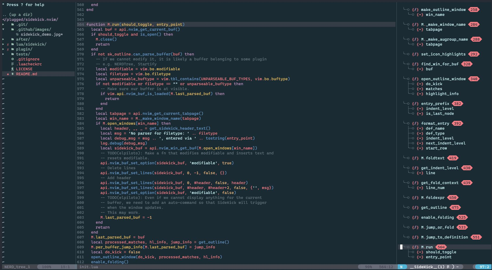

# sidekick.nvim
An outline window that's always by your side (except for when it's not).

### WIP: This plugin is not yet ready for widespread use.
It requires neovim (~nightly build) and `nvim-treesitter`.

```
   _____ _     __     __ __ _      __   
  / ___/(_)___/ /__  / //_/(_)____/ /__ 
  \__ \/ / __  / _ \/ ,<  / / ___/ //_/ 
 ___/ / / /_/ /  __/ /| |/ / /__/ ,<    
/____/_/\__,_/\___/_/ |_/_/\___/_/|_|   
=======================================
```



### Current configuration settings (WIP)

Values below reflect sensible defaults.  If you do not have a font patched with nerd fonts, you should change the unicode/icons below.

```
" To actually use sidekick!
nmap <F8> :call SideKickNoReload()<CR>

let g:sidekick_update_on_buf_write = 1
" List of which definition types to display:
" Example: 'function' tells sidekick to display any node found in a ts 'locals' query
" that is captured in `queries/$LANG/locals.scm` as '@definition.function'.
let g:sidekick_printable_def_types = ['function', 'class', 'type', 'module', 'parameter', 'method', 'field']
" Mapping from definition type to the icon displayed for that type in the outline window.
let g:sidekick_def_type_icons = {
\    'class': "\uf0e8",
\    'type': "\uf0e8",
\    'function': "\uf794",
\    'module': "\uf7fe",
\    'arc_component': "\uf6fe",
\    'sweep': "\uf7fd",
\    'parameter': "•",
\    'var': "v",
\    'method': "\uf794",
\    'field': "\uf6de",
\ }

" Indicates which definition types should have their line number displayed in the outline window.
let g:sidekick_line_num_def_types = {
\    'class': 1,
\    'type': 1,
\    'function': 1,
\    'module': 1,
\    'method': 1,
\ }

" What to display between definition and line number
let g:sidekick_line_num_separator = " "
" What to display to the left and right of the line number
let g:sidekick_line_num_left = "\ue0b2"
let g:sidekick_line_num_right = "\ue0b0"
" What to display before outer vs inner definitions
let g:sidekick_inner_node_icon = "\u251c\u2500\u25B8"
let g:sidekick_outer_node_icon = "\u2570\u2500\u25B8"
" What to display to left and right of def_type_icon
let g:sidekick_left_bracket = "\u27ea"
let g:sidekick_right_bracket = "\u27eb"

```

### Requirements

- neovim nightly
- default config requires patched nerd fonts
- nerdtree.nvim

### TODO

- [x] Jump from outline to definition
- [x] Update outline on editor events
  - [x] Buffer save
  - [x] Change active window
- [ ] Display filename (buffer name) in sidekick.
- [ ] Add custom fold highlight while we want for neovim bug about highlighting folds to get fixed.
- [X] Allow empty sidekick window. Currently we just don't open an outline window if the current bufffer is empty or corresponds to an un-supported (by treesitter) filetype.
- [ ] Set window settings to stop context.vim from popping up.
- [ ] Add documentation.
- [ ] Improve plugin configs
  - [ ] Add supported options to documentation.
  - [X] Add error-checking / default values.
- [ ] Decouple rendering from outline in order to:
  1. Allow smarter rendering (e.g. isolated top-level nodes should be displayed as `outerNode`)
  2. Interface to allow other tag definition backends (e.g. LSP or ctags)
- [ ] After jumping to definition, scroll screen upwards (add config option to control this).
- [ ] Document highlight groups so that colorschemes can explicitly support them.
- [ ] Learn how to make tests for your plugin and test your code, guy.
- [X] Use treesitter to generate outline for custom queries (~~`queries/$LANG/sidekick.scm`~~ `queries/$LANG/locals.scm`)
- [X] Use treesitter to generate outline for "standard" queries (`queries/$LANG/locals.scm`)
- [ ] Let users specify what definitions get shown for standard queries.   
- [X] Display line number after definitions in outline window.

### BUGS

- [X] Outline is incomplete: functions are missing - may be a max line issue.
- [X] Outline is cut off for first entry.
- [X] Window contains parts of multiple outlines when switching windows (clear sidekick buffer).
- [ ] First entry is not foldable.
- [ ] Add auto-command to run Sidekick on BufEnter for buffers that cannot be parsed.

### Roadmap

- [ ] Sort by order or kind.  
- [ ] Generate outline based on LSP.  
- [ ] Pop-up documentation for symbol when using LSP.  
- [ ] After getting experience, re-write most of codebase using an extensible system to allow end users to populate outline window.


### Maybe features  

- [ ] Generate outline based on tags file.  
- [ ] When using treesitter for outline *and* LSP is available, pop-up documentation for symbol.
